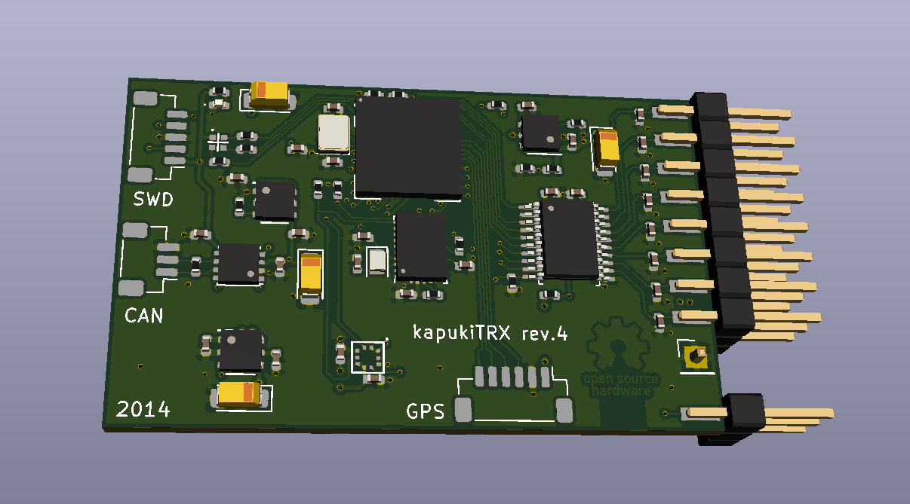

# Redundant RC transmitter module & 8 channel receiver
RC Receiver and transmitter module using redundant SX1280 RF modules.

[Please take a look at my previous project here](https://github.com/bodri/RcReceiver)

# Design

# Manufacturing
I would like to compare services from [OSHPark](http://oshpark.com)/[OSH Stencils](https://www.oshstencils.com) and [JLCPCB](http://jlcpcb.com), so I ordered:

| Manufacturer | Items             | Price  | Order date | Shipped      | Received   | Total days |
|--------------|-------------------|--------|------------|--------------|------------|------------|
| OSHPark      | 3 PCBs            | $19.80 | 09/11/2019 | 21/11/2019** | 17/12/2019 | 21 (35)**  |
| OSH Stencils | 1 stencil         | $21.60 | 09/11/2019 | 12/11/2019   | 19/11/2019 | 10         |
| JLCPCB       | 10 PCBs + stencil | $28.33 | 09/11/2019 | 14/11/2019   | 03/12/2019 | 21         |

** Originally was shipped on 21/11/2019 and received on the same day as the JLCPCB package, but I have received a message that the PCBs have "Severe over-etching in some regions" therefore not to use them. OSHPark refabricated them and I received the second batch on 17/12/2019.
